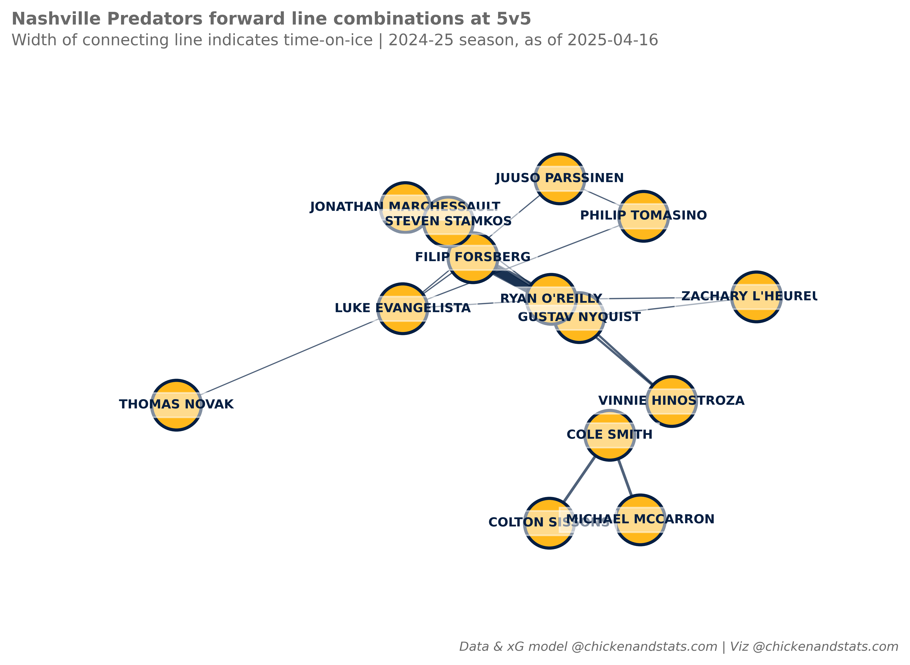

# :material-view-gallery: **Gallery**

See below for a collection of charts and graphics created using the `chickenstats` library

??? info
    Most of these examples can be recreated using the tutorial notebooks from the Examples section in the 
    [`chickenstats` GitHub repository](https://github.com/chickenandstats/chickenstats/tree/main/examples) or the 
    tutorials section of the [:material-school: User Guide](../index.md)

---

-   **[NSH forward lines' rink maps](../tutorials/shot_maps.md)**

    ---

    

-   **[NSH time-on-ice network](../tutorials/network.md)**

    ---

    

